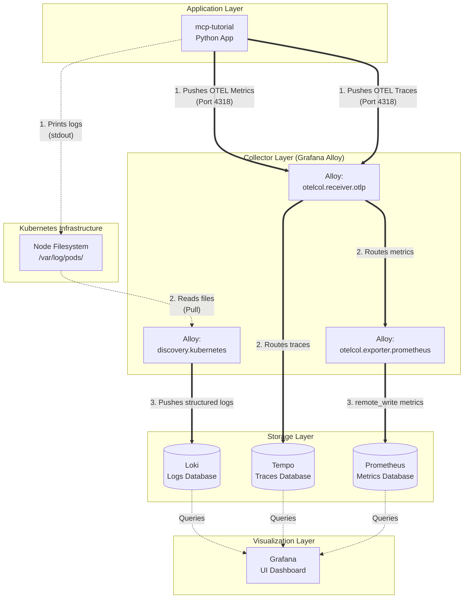

# Observability Architecture

This document describes the telemetry data flow for the applications deployed in this cluster. The stack uses a hybrid approach of **OpenTelemetry (Push)** for metrics and traces, and **Kubernetes Native (Pull)** for logs.

Grafana Alloy acts as the central collector and router for all telemetry data.

## Telemetry Flows

### 1. Traces (Push)
- **Protocol:** OpenTelemetry (OTLP) gRPC/HTTP
- **Flow:** Application -> Alloy -> Tempo
- **Mechanism:** The application is instrumented with the OpenTelemetry SDK. It actively pushes trace spans over the network to Alloy on port `4318`. Alloy receives these spans and forwards them directly to Tempo.

### 2. Metrics (Push)
- **Protocol:** OpenTelemetry (OTLP) to Prometheus Remote Write
- **Flow:** Application -> Alloy -> Prometheus
- **Mechanism:** Similar to traces, the application actively pushes OTLP metrics to Alloy on port `4318`. Alloy uses the `otelcol.exporter.prometheus` component to translate the OTLP metrics into Prometheus format, and pushes them into Prometheus using the `remote_write` API.

### 3. Logs (Pull)
- **Protocol:** File reading / Loki Push API
- **Flow:** Application -> `stdout` (Disk) -> Alloy -> Loki
- **Mechanism:** The application simply prints logs to standard output (`stdout`). Kubernetes automatically writes these to log files on the host node (`/var/log/pods/...`). Alloy uses `discovery.kubernetes` to find the pods, reads the log files from the disk, attaches Kubernetes metadata (namespace, pod, container), and pushes the structured logs to Loki.

---

## Architecture Diagram

## Why this architecture?
1. **Clean App Config:** The application only needs to know about one network destination (Alloy) for pushing telemetry.
2. **Reliable Logs:** By relying on standard Kubernetes log scraping, logs are buffered on disk. If Alloy crashes, it remembers its position and no logs are lost. If the application crashes, the logs are safely written to disk before the crash.
3. **Unified Translation:** Alloy handles translating OpenTelemetry metrics into a format Prometheus can natively ingest.
